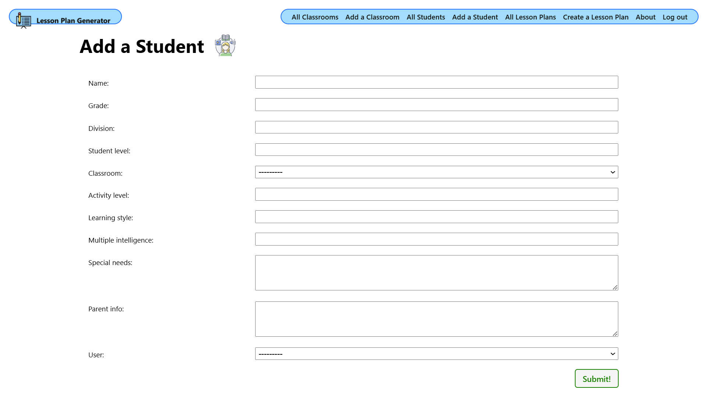

# Lesson Plan Generator - Django Python Project

## Project Overview

The Lesson Plan Generator is a web application built using Django and Python that allows teachers to create, manage, and organize lesson plans efficiently. This tool helps educators structure their teaching materials, assign lesson plans to classrooms, and track student progress.

## Project Done By:

May Alrowaie [LinkedIn](https://www.linkedin.com/in/may-alrowaie)

## Features:

**Create Lesson Plans**: Teachers can design structured lesson plans, including objectives, activities, and assessments.

**Assign to Classrooms**: Lesson plans can be linked to specific classrooms to ensure appropriate content delivery.

**Manage Lesson Plans**: Teachers can edit, delete, and view their lesson plans.

**Student Management**: View a list of students in a classroom and share students information from all teachers using the app in the school to track their individual progress.

**Feedback System**: Teachers can add feedback and share feedback from all teachers using the app in the school for classrooms based on student performance.

**Integration of Technology**: Supports incorporating teaching strategies and technological tools to enhance learning outcomes.

## User Stories

1. **User**

   - As a teacher, I want to create an account, so that I can manage my classrooms and lesson plans.
   - As a teacher, I want to log in securely, so that I can access my personalized lesson plans and student data.
   - As a teacher, I want to update my profile information (name, email), so that my account stays up-to-date.
   - As a teacher, I want to reset my password, so that I can regain access if I forget it.

2. **Classroom**

- As a teacher, I want to create a classroom, so that I can assign students and lesson plans to it.
- As a teacher, I want to add students to a classroom, so that I can track their progress and customize lesson plans.
- As a teacher, I want to edit classroom details (grade, division), so that I can keep my records accurate.
- As a teacher, I want to assign lesson plans to a specific classroom, so that I can organize my teaching resources efficiently.
- As a teacher, I want to view a list of students in each classroom, so that I get information about them like multiple intelligences academic level and learning styles to help me tailor my lesson to accommodate their needs.

- As a teacher, I want to leave feedback on a classroom, so that I can document observations and make improvements.
- As a teacher, I want to delete a classroom, so that I can remove outdated or irrelevant classrooms.

  3.**Student**

- As a teacher, I want to add a student to my database, so that I can assign the proper lesson plans to them.
- As a teacher, I want to update student details (grade, division, learning style, special needs etc), so that I can tailor lesson plans accordingly.
- As a teacher, I want to store parent information for each student, so that I can communicate effectively with them about progress.
- As a teacher, I want to view a student’s assigned lesson plans, so that I can track their learning progress.
- As a teacher, I want to delete a student , so that I can remove outdated or irrelevant information.

  4.**Lesson Plans**

  - As a teacher, I want to create a lesson plan, so that I can structure my teaching materials.
    As a teacher, I want to specify the subject, title, grade level, division, and duration when creating a lesson plan, so that it is well-organized
  - As a teacher, I want to add objectives, integration strategies, and teaching strategies to a lesson plan, so that it aligns with learning goals.
  - As a teacher, I want to include a description and activity level in a lesson plan, so that I can differentiate instruction.
  - As a teacher, I want to list activities, assessments, and technology used in a lesson plan, so that I can plan my teaching effectively.
  - As a teacher, I want to add an alternative "Plan B" section to a lesson plan, so that I have a backup strategy if the original plan does not work.
  - As a teacher, I want to edit a lesson plan after creation, so that I can make improvements.
  - As a teacher, I want to delete a lesson plan, so that I can remove outdated or irrelevant plans.
  - As a teacher, I want to assign lesson plans to specific classrooms, so that I can organize my lesson plans.
  - As a teacher, I want to view all my lesson plans, so that I can manage my teaching materials efficiently.

## Screenshots

## Project Links

- [Backend](https://github.com/May-alrowaie/lesson-planner)

### Initial ERD

### Revised ERD:

## Technologies Used

**Backend**: Django (Python)

**Frontend**: HTML, CSS

**Database**: PostgreSQL

**Authentication**: Django User Authentication

## Installation

1-**Clone the repository**:

git clone https://github.com/May-alrowaie/lesson-planner.git

cd lesson-planner

2- **Install dependencies**:

pip install

3- **Run database migrations**:

python manage.py migrate

4- **Create a superuser**:

python manage.py create superuser

5- **Start the server**:

python manage.py runserver

6-**Access the application**:
at http://127.0.0.1:8000/

## Planned Future Enhancements

AI-based lesson plan suggestions

Collaborative lesson planning for multiple teachers

Mobile-friendly UI improvements

## Contributors

May abdul rahman alrowaie (Project Owner & Developer)
